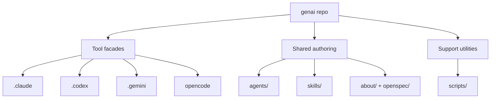

# Components

## System Overview

## Component Inventory

| Component | Responsibility | Stability |
|-----------|----------------|-----------|
| `.claude/` | Claude Code-specific instructions, settings, plugins, and mirrored skill entrypoints | Stable interface, active content |
| `.codex/` | Codex-specific instructions, config, rules, prompts, and mirrored skill entrypoints | Stable interface, active content |
| `.gemini/` | Gemini CLI-specific directives, runtime config, and mirrored skill entrypoints | Stable interface, active content |
| `opencode/` | OpenCode-specific config surface | Smaller but stable adapter |
| `agents/` | Older tool-agnostic role prompts retained for reference or selective reuse | Secondary reference layer |
| `skills/` | Reusable task skills, references, scripts, and assets; primary shared workflow layer | Canonical local shared layer |
| `scripts/` | Repository-level maintenance utilities | Narrow support layer |
| `about/` | Human-and-agent orientation docs | New canonical documentation layer |
| `openspec/` | Normative requirements and change records | New canonical requirements layer |

## Boundary Notes

- `skills/` owns the main reusable workflow semantics.
- `agents/` is a reference layer, not the default execution path.
- Tool facades own runtime-specific syntax and metadata.
- `about/` and `openspec/` own the explanation of where things belong and why.
- Generated or vendored outputs may sit under a skill or tool facade, but only with a documented regeneration path.
