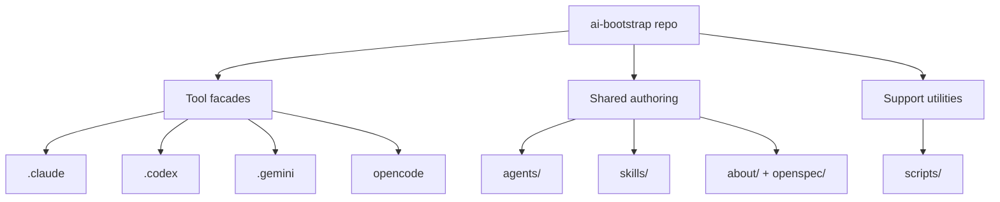

# Components

## System Overview

## Component Inventory

| Component | Responsibility | Stability |
|-----------|----------------|-----------|
| `.claude/` | Tracked Claude config plus ignored runtime/plugin state; install target is `~/.claude` | Mixed tracked config + local runtime state |
| `.codex/` | Tracked Codex config; mirrored skills and most runtime state are ignored locally | Mixed tracked config + local runtime state |
| `.gemini/` | Tracked Gemini config; mirrored skills, antigravity runtime state, and local auth/runtime data are ignored locally | Mixed tracked config + local runtime state |
| `opencode/` | OpenCode-specific config surface installed under `$HOME/.config/opencode`; no in-repo skill mirror surface today | Smaller tracked adapter |
| `skills/personal/` | Primary locally authored workflow layer, including Beads and project-shape methods | Canonical local authored layer |
| `skills/` non-`personal/` | Upstream-derived submodules, vendored skills, and intentional forks that still mirror from this repo locally | Canonical local mirror source with upstream provenance |
| `agents/` | Older tool-agnostic role prompts retained for reference or selective reuse | Secondary reference layer |
| `scripts/` | Repository-level maintenance utilities | Narrow support layer |
| `about/` | Human-and-agent orientation docs | New canonical documentation layer |
| `openspec/` | Normative requirements and change records | New canonical requirements layer |

## Boundary Notes

- `skills/` owns the main reusable workflow semantics and is the only layer mirrored broadly across tool skill directories.
- `skills/personal/` is the main locally maintained workflow surface; most other top-level skill trees retain upstream provenance.
- `agents/` is a reference layer, not the default execution path.
- Tool facades mix tracked baseline config with ignored runtime or mirror surfaces; they are not uniformly canonical.
- `about/` and `openspec/` own the explanation of where things belong and why.
- Generated or vendored outputs may sit under a skill or tool facade, but only with a documented regeneration path.
