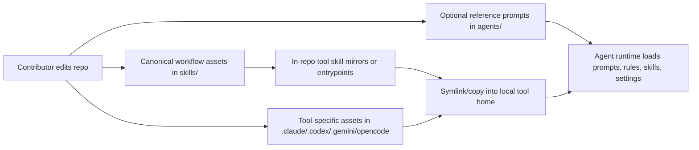
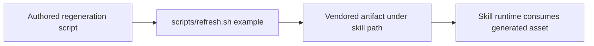

# Data Flow

## Authoring to Consumption

## Generated Asset Flow

## Trust and Drift Boundaries

- Human-authored source for day-to-day workflow logic lives in `skills/`; `agents/` is a secondary reference source.
- In-repo tool skill mirrors are distribution surfaces, not the authored source of truth.
- Installed home-directory or XDG copies are distribution outputs, not the repository's only source of truth.
- Generated assets are acceptable only when the regeneration path is checked in; `scripts/refresh.sh` is an example, not the only allowed pattern.
- Runtime traces, caches, local auth, and machine-private IDs sit outside the canonical flow and should not round-trip back into git.
