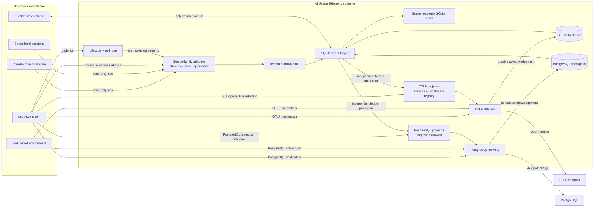

# Component Map

**Status:** Accepted, **[Inferred]** target-state component ownership derived
from adopted doctrine and accepted RFC 0001. No application package or runtime image exists
yet.

## System Context

## Component Inventory

| Component | Owns | Must not own | Governing contract |
|---|---|---|---|
| Container entrypoint and poll loop | Lifecycle, configurable interval with a five-minute default, graceful shutdown, cycle coordination | Host scheduling or tool authentication | RFC 0001, Runtime and configuration |
| Source-family adapters | Tool-specific discovery and a code-owned extraction registry; per-stream parsing, identity context, cursor, and quarantine | Sink behavior, permissive unknown-record fallback, or generic persistence policy | RFC 0001, Source adapter contract |
| Normalized record model | `UsageEvent`, `QuotaSnapshot`, stable ledger admission/schema, category validation | Raw prompt/response payloads, arbitrary passthrough fields, or configuration-defined fact identity | RFC 0001, Normalized records |
| SQLite ledger and local views | Fact identity and accounting fingerprints, stream cursors, aggregates, independent sink checkpoints, indefinite history, and stable read-only views | Inbound API or sink-specific fact semantics | RFC 0001, Ledger and transaction boundary |
| OTLP projector and delivery | Bounded cumulative usage metrics, quota/freshness gauges, attribute/vocabulary registry, delivery, and its own checkpoint | Session IDs, source paths, raw metadata, historical event storage, or PostgreSQL progress | RFC 0001, OTLP sink |
| PostgreSQL projector and delivery | Projection allowlist, idempotent analytical usage/quota rows, delivery, and its own checkpoint | Stream cursor authority, raw source archives, or OTLP progress | RFC 0001, PostgreSQL sink |
| Configuration loader | TOML validation, cadence, source selection, source/sink enablement, aliases, endpoint settings, and allowed projection subsets | Extraction safety, ledger admission, fact identity/fingerprint, or credentials embedded in versioned config | RFC 0001, Runtime and configuration |
| Operational health | Per-stream cursor/quarantine/freshness, non-masking family/global summaries, ledger state, and per-sink delivery state | Prompt content or misleading aggregate health | RFC 0001, Failure isolation and observability |

## External Dependencies

- **[Observed] Claude Code** writes assistant usage records under its local
  project session store. Its observed quota cache is embedded in
  credential-bearing global state and is not an admissible source.
- **[Observed] Codex** writes cumulative token state, preceding turn context,
  the most recently stored contribution, and rate-limit snapshots in local
  session JSONL. Non-usage updates may repeat that contribution.
- **[Inferred] SQLite** is embedded inside the container and persists only on
  the mounted state volume.
- **[Inferred] OTLP and PostgreSQL** are optional, independently enabled
  outbound dependencies. Neither is an ingestion prerequisite.
- **[Unknown] Future tools** may lack a content-free local usage source and are
  not assumed to fit the adapter contract automatically.

## Ownership Boundaries

1. Tool-specific interpretation ends at the source-adapter boundary.
2. Record semantics, logical identity, and accounting fingerprints are
   sink-independent and cannot change with export configuration.
3. Each source stream owns its cursor, parser context, quarantine, and health;
   family summaries never mask a degraded stream.
4. The ledger is the sole local authority for replay and committed history.
5. OTLP and PostgreSQL each consume the ledger independently and own separate
   projection rules, delivery workers, and checkpoints.
6. Host-specific registry coordinates, endpoints, credentials, and absolute
   mount paths remain outside versioned project content.
