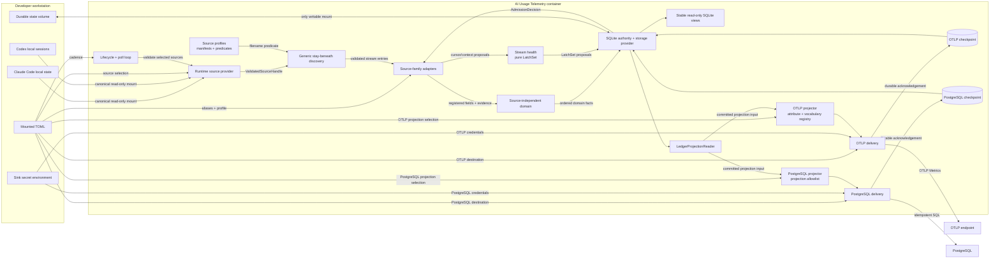

# Component Map

**Status:** Independently accepted, **[Inferred]** target-state component
ownership derived from adopted doctrine and the RFC 0001 design contract. Exact
linked-RFC byte authority follows the central
[lifecycle matrix](../README.md#lifecycle-status). No application package or
runtime image exists yet.

## System Context

## Component Inventory

| Component | Owns | Must not own | Governing contract |
|---|---|---|---|
| Container entrypoint and poll loop | Lifecycle, configurable interval with a five-minute default, graceful shutdown, cycle coordination | Host scheduling or tool authentication | RFC 0001, Runtime and configuration |
| Runtime source provider | Canonical mount/path checks and opaque `ValidatedSourceHandle` creation | Filename predicates, discovery traversal/generation, parsing, or source semantics | RFC 0001, Runtime and trust boundary |
| Generic source discovery | Regular-file/non-symlink stay-beneath traversal and stream generation from validated handles | Runtime mount validation, adapter manifests, or fact semantics | RFC 0001, Incremental reads |
| Source-family adapters | Tool-specific filename predicates, extraction manifests, source fields/evidence, parser context, and candidate ordering | Runtime/storage preflight, generic discovery, domain identity/time/path/category/fingerprint/age primitives, sink behavior, or persistence | RFC 0001, Source adapter contract |
| Source-independent domain model | `UsageEvent`, `QuotaSnapshot`, fact/request/subject identity, canonical instant and cwd basename, categories, fingerprints, checked age, and selection | Adapter imports, raw records, traversal, or persistence | RFC 0001, Normalized records |
| Stream reconciliation and health | Cursor/rescan proposals and pure `LatchSet` transition/precedence/recovery | SQLite persistence or query/view implementation | RFC 0001, Incremental reads and health |
| SQLite ledger and storage provider | `AdmissionDecision`, facts, stream/latch/cache persistence, aggregates, independent sink checkpoints, indefinite history, and `LedgerProjectionReader` | Domain or latch policy, public views, raw records, or sink semantics | RFC 0001, Ledger and transaction boundary |
| Local query and inspection | Stable read-only SQLite views and structured health, projecting/validating owner-produced values | Ledger authority, latch/age/admission reimplementation, sink delivery, or writes | RFC 0001, Health and query contract |
| OTLP projector and delivery | Bounded cumulative usage metrics from `LedgerProjectionReader`, quota/freshness gauges, attribute/vocabulary registry, delivery, and its own checkpoint | Public-view/private-table queries, session IDs, source paths, historical event storage, or PostgreSQL progress | RFC 0001, OTLP sink |
| PostgreSQL projector and delivery | Projection allowlist, idempotent analytical usage/quota rows from `LedgerProjectionReader`, delivery, and its own checkpoint | Public-view/private-table queries, stream cursor authority, raw source archives, or OTLP progress | RFC 0001, PostgreSQL sink |
| Configuration loader | TOML validation, cadence, source selection, source/sink enablement, aliases, endpoint settings, and allowed projection subsets | Extraction safety, ledger admission, fact identity/fingerprint, or credentials embedded in versioned config | RFC 0001, Runtime and configuration |
| Operational health | Per-stream cursor/quarantine/freshness, non-masking family/global summaries, ledger state, and per-sink delivery state | Prompt content or misleading aggregate health | RFC 0001, Failure isolation and observability |

## External Dependencies

- **[Observed] Claude Code** writes assistant usage records under its local
  project session store. Its observed quota cache is embedded in
  credential-bearing global state and is not an admissible source.
- **[Observed] Codex** writes cumulative token state, preceding turn context,
  the most recently stored contribution, and rate-limit snapshots in local
  session JSONL. Non-usage updates may repeat that contribution.
- **[Inferred] SQLite** is embedded inside the container and persists only on
  the mounted state volume.
- **[Inferred] OTLP and PostgreSQL** are optional, independently enabled
  outbound dependencies. Neither is an ingestion prerequisite.
- **[Unknown] Future tools** may lack a content-free local usage source and are
  not assumed to fit the adapter contract automatically.

## Ownership Boundaries

1. Runtime validation returns `ValidatedSourceHandle`; generic discovery owns
   traversal/generation; adapters own only predicates/manifests and source
   interpretation.
2. Source-independent domain interfaces own record semantics, logical identity,
   canonical instant/cwd/category/fingerprint/age primitives, and never import
   adapters.
3. Stream health owns pure `LatchSet`; the ledger persists proposals/cache and
   query projects/validates them without reimplementation.
4. The ledger is the sole local authority for admission, replay, committed
   history, and `LedgerProjectionReader`.
5. Stable public views branch directly from the ledger. OTLP and PostgreSQL
   branch separately through `LedgerProjectionReader`, never through those views.
6. Host-specific registry coordinates, endpoints, credentials, and absolute
   mount paths remain outside versioned project content.
