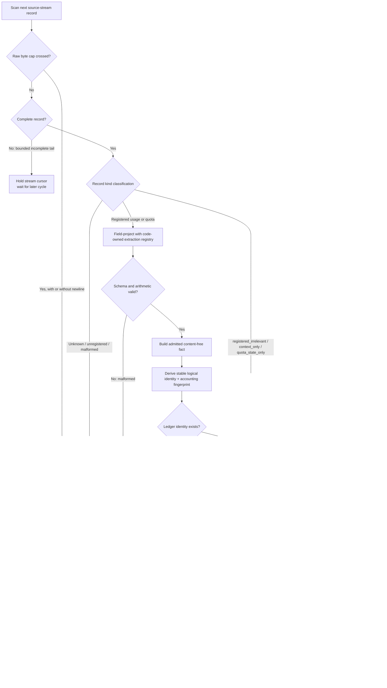

# Data Flow

**Status:** Accepted, **[Inferred]** target-state flow, grounded in the
**[Observed]** local record shapes described in
[`RFC 0001`](../legends-and-lore/rfcs/0001-adapter-ledger-and-sink-contract.md).

## Usage and Quota Flow

## Trust-Boundary Transitions

1. **Untrusted local format → stream validation.** A source family contains
   independently ordered source streams, and streams contain records. Files are
   read-only and may be active, incomplete, repeated, truncated, rotated, or
   changed by a tool update. Complete records are not trusted merely because
   they parse as JSON.
2. **Adapter output → normalized record.** A field-projecting streaming parser
   decodes only paths in the code-owned extraction registry. The stable ledger
   admission/schema then decides what may become a fact. Prompt/response content
   and credentials have no normalized representation and are skip-only.
3. **Normalized record → durable ledger.** Identity, record data, cursor,
   aggregates, and sink-pending state change in one SQLite transaction. Identity
   and the accounting fingerprint exclude cursor positions and export/config
   choices. A crash before commit changes nothing; a crash after commit is
   replayable.
4. **Ledger → OTLP.** The projection deliberately drops event/session
   identifiers, raw paths, and unbounded metadata. Only dimensions and finite
   values in the OTLP attribute/vocabulary registry cross this boundary.
5. **Ledger → PostgreSQL.** Stable normalized columns and metadata selected by
   the PostgreSQL projection allowlist cross this boundary. Delivery and its
   checkpoint are independent from OTLP.

## Source-Specific Context

- **[Observed/Inferred] Claude Code family:** one assistant usage observation
  can appear on repeated physical records. The versioned adapter deduplicates by
  an evidence-backed native identity instead of counting JSONL lines. Claude
  quota remains `unknown/unavailable`; its credential-bearing global state is
  not mounted.
- **[Observed/Inferred] Codex family:** token-count state does not carry all
  attribution fields and may repeat the previous contribution on a
  rate-limit-only update. Each stream applies the latest preceding turn context
  and emits usage only for validated cumulative advancement. Parser context
  persists with that stream's cursor and never crosses into another stream.
- **[Unknown] Future adapter:** admission requires a stable content-free event
  identity, source-time semantics, and quota capability decision. A cloud-only
  dashboard is not silently treated as a local adapter.

## Failure Paths

- An incomplete final JSONL record below the active byte cap waits for a later
  cycle with its stream cursor held. Crossing the cap without a newline is an
  immediate `record_limit` quarantine, not an indefinitely deferred tail.
- Only `registered_irrelevant`, `context_only`, or `quota_state_only` may advance
  a complete record with zero facts, and only when its permitted parser-context
  or quota-component transition and cursor commit in the same ledger
  transaction.
- A missing required profile member or bound is `unsupported_profile` before
  traversal; a missing or wrongly typed required projected record value is
  `recognized_malformed`; only measured bound overflow is `record_limit`.
- An unknown kind or malformed/semantically inconsistent complete record
  quarantines only its stream, leaves its cursor before the record, and emits a
  degraded signal that family/global summaries do not mask.
- A failed sink retains its own pending work; the other sink continues.
- A poll cycle never marks stale quota data fresh merely because the collector
  reread it.
- Missing quota data is unavailable or stale, never zero utilization.
