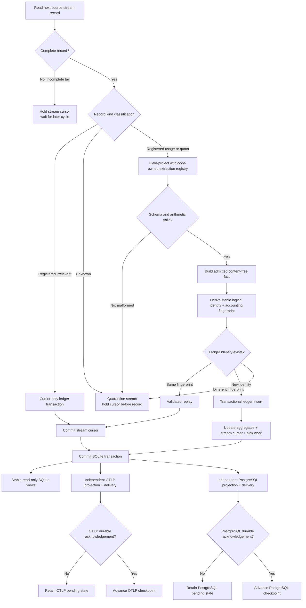

# Data Flow

**Status:** Proposed, **[Inferred]** target-state flow, grounded in the
**[Observed]** local record shapes described in
[`RFC 0001`](../legends-and-lore/rfcs/0001-adapter-ledger-and-sink-contract.md).

## Usage and Quota Flow

## Trust-Boundary Transitions

1. **Untrusted local format → stream validation.** A source family contains
   independently ordered source streams, and streams contain records. Files are
   read-only and may be active, incomplete, repeated, truncated, rotated, or
   changed by a tool update. Complete records are not trusted merely because
   they parse as JSON.
2. **Adapter output → normalized record.** A field-projecting streaming parser
   decodes only paths in the code-owned extraction registry. The stable ledger
   admission/schema then decides what may become a fact. Prompt/response content
   and credentials have no normalized representation and are skip-only.
3. **Normalized record → durable ledger.** Identity, record data, cursor,
   aggregates, and sink-pending state change in one SQLite transaction. Identity
   and the accounting fingerprint exclude cursor positions and export/config
   choices. A crash before commit changes nothing; a crash after commit is
   replayable.
4. **Ledger → OTLP.** The projection deliberately drops event/session
   identifiers, raw paths, and unbounded metadata. Only dimensions and finite
   values in the OTLP attribute/vocabulary registry cross this boundary.
5. **Ledger → PostgreSQL.** Stable normalized columns and metadata selected by
   the PostgreSQL projection allowlist cross this boundary. Delivery and its
   checkpoint are independent from OTLP.

## Source-Specific Context

- **[Observed] Claude Code family:** one billable assistant response can appear
  on several content-block records. Its streams deduplicate by stable
  message/request identity instead of counting JSONL lines. Quota freshness
  preserves source observation time separately from collection time.
- **[Observed] Codex family:** usage deltas do not carry all attribution fields.
  Each stream processes records sequentially and applies the latest preceding
  turn context to token records. Parser context persists with that stream's
  cursor and never crosses into another stream.
- **[Unknown] Future adapter:** admission requires a stable content-free event
  identity, source-time semantics, and quota capability decision. A cloud-only
  dashboard is not silently treated as a local adapter.

## Failure Paths

- An incomplete final JSONL record waits for a later cycle with its stream cursor
  held and is not yet quarantined.
- Only an explicitly registered irrelevant record may advance a stream cursor
  without producing a fact.
- An unknown kind or malformed/semantically inconsistent complete record
  quarantines only its stream, leaves its cursor before the record, and emits a
  degraded signal that family/global summaries do not mask.
- A failed sink retains its own pending work; the other sink continues.
- A poll cycle never marks stale quota data fresh merely because the collector
  reread it.
- Missing quota data is unavailable or stale, never zero utilization.
