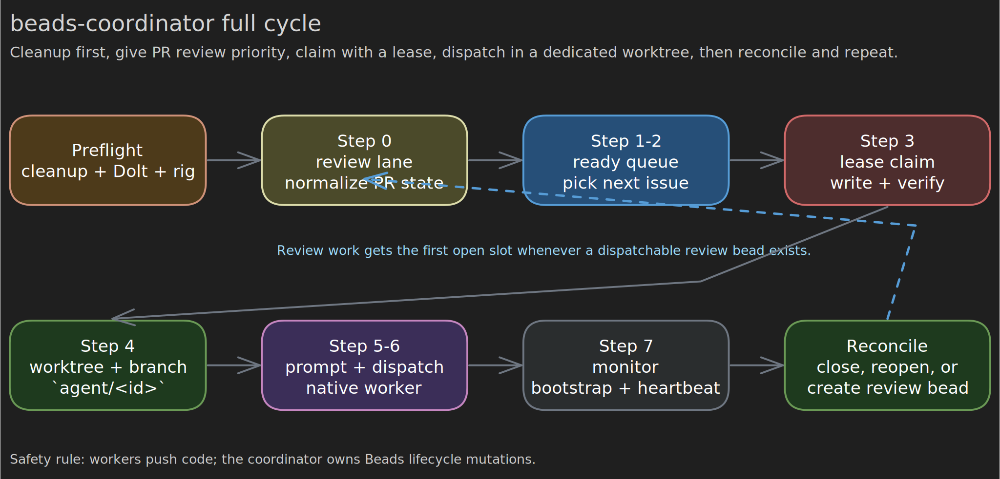
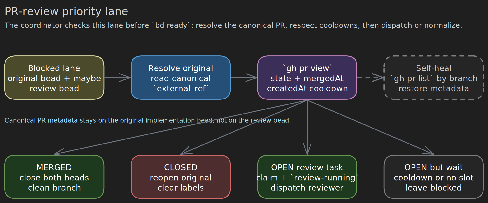

# beads-coordinator

`beads-coordinator` is an orchestration skill for unattended Beads throughput. It does not implement code itself. It continuously normalizes Beads state, gives PR review work priority, claims ready issues with durable leases, dispatches isolated workers, and reconciles worker outcomes back into Beads.

This README consolidates the workflow described across `SKILL.md` and the reference files into one operator-facing document.



Source: [`assets/coordinator-cycle.excalidraw`](assets/coordinator-cycle.excalidraw)

## What The Coordinator Owns

- Running `beads-cleanup` before the main loop.
- Normalizing blocked PR-review state before new implementation dispatch.
- Claiming beads with a lease before mutation or worker dispatch.
- Creating worktrees and dispatch prompts.
- Monitoring workers and reconciling outcomes.
- Canonical Beads lifecycle mutations such as `bd create`, `bd update`, `bd dep add`, and `bd close`.

Workers push code and report outcomes. The coordinator owns the Beads state machine.

## Core Invariants

- Max parallel workers is `3` by default unless explicitly overridden.
- Every worker gets its own worktree under `.worktrees/parallel-agents/<id>` and branch `agent/<id>`.
- A worker does not count as running until it proves `pwd == WORKTREE_PATH`, the branch matches, and it is not operating from `REPO_ROOT`.
- Review work has priority over new implementation work whenever a dispatchable `pr-review-task` bead exists.
- PR metadata is canonical on the original implementation bead only: `external_ref=gh-pr:<N>`.
- `review-running` is the lock label for an actively dispatched review bead.
- Beads data lives in Dolt, not in git-tracked files. `.beads/` diffs on code branches are drift and should be stripped.

## Full Loop

### 1. Preflight

Before the loop starts, run `beads-cleanup`. This is mandatory.

Preflight also verifies:

- the correct rig or working directory
- Dolt health with `bd dolt status`
- stale `in_progress` beads, stale review locks, orphaned worktrees, and merged/closed PR cleanup

### 2. Step 0: Normalize The PR-Review Lane

Before `bd ready`, inspect blocked PR-review state:

```bash
bd list --status=blocked --label pr-review --json
```

This lane may contain:

- blocked original implementation beads waiting on PR outcome
- blocked dedicated `pr-review-task` beads

The coordinator then:

1. Resolves the original bead for each review task.
2. Reads the canonical PR number from the original bead's `external_ref`.
3. Dedupes review beads so only one active review bead exists per original/PR pair.
4. Checks live PR state with `gh pr view`.
5. Applies the 5-minute review cooldown after PR creation.
6. Dispatches an eligible `pr-review-task` bead before any new implementation work.

It also runs the self-heal pass:

```bash
gh pr list --state open --json number,url,headRefName,createdAt
```

For any PR whose head is `agent/<issue-id>`, the coordinator restores missing Beads metadata on the original bead and ensures exactly one dedicated review bead exists.



Source: [`assets/pr-review-lane.excalidraw`](assets/pr-review-lane.excalidraw)

### 3. Step 1: Discover Ready Work

Only when no dispatchable review bead is waiting for an open slot:

```bash
bd ready --json
```

If nothing is ready, the coordinator polls again later.

### 4. Step 2: Select The Next Issue

Selection rules:

1. Lowest numeric priority first.
2. Oldest `created_at` breaks ties.
3. Skip issues already assigned to a live worker.
4. Skip issues with a live foreign lease.
5. Do not start new implementation work while an eligible review bead is waiting.

### 5. Step 3: Claim With A Lease

The intended model is lease-based claiming, not blind status writes.

Preferred lease fields:

- `lease_owner`
- `lease_token`
- `lease_expires_at`
- `last_heartbeat_at`

Operational rules:

- Lease TTL is 20 minutes.
- Renew every 5 minutes.
- Renew immediately after claim.
- Renew before every `bd create`, `bd update`, `bd dep add`, or `bd close`.
- Renew after long `gh`, rebase, merge, or test operations.

If a live foreign lease exists, skip the bead.

### 6. Step 4: Prepare The Worker Environment

For a claimed issue, create an isolated worktree:

```bash
bd worktree create .worktrees/parallel-agents/<id> --branch agent/<id>
```

The dispatch prompt should inject:

- `ISSUE_ID`
- `ISSUE_JSON` from `bd show <id> --json`
- `WORKTREE_PATH`
- `REPO_ROOT`

Worker choice:

- normal implementation bead: `beads-worker`
- `pr-review-task` bead: `beads-pr-reviewer-worker`
- tightly coupled epic: Team Lead mode from `references/epic-coordination.md`

### 7. Step 5: Dispatch

Dispatch must use the runtime's native subagent mechanism. Do not shell out to CLI agent binaries.

Codex-specific rules:

- dispatch with `fork_context=false`
- require bootstrap evidence before counting a slot as occupied
- treat `wait_agent` timeout as still running, not failure
- use the Codex stall threshold from the runtime notes rather than the generic shorter fallback

### 8. Step 6: Monitor

The coordinator tracks:

- issue id
- worktree path
- branch
- start time
- bootstrap status
- last progress signal

Bootstrap failure means the worker never proved the correct worktree or branch. That is a dispatch failure, not an implementation stall.

### 9. Step 7: Reconcile Outcomes

Normal implementation outcomes are:

- PR opened
- direct-merge candidate
- blocked or needs coordinator help

Reconciliation rules:

- If a worker opened a PR, block the original bead, store `external_ref=gh-pr:<N>`, create or reuse exactly one dedicated review bead, add dependency `original -> review`, and return to the PR-review lane.
- If a worker reports a direct-merge candidate, the coordinator may fast-forward merge and close the bead.
- If a worker reports blockers or follow-up work, the coordinator creates those beads sequentially.

## Review Lane Outcomes

When the PR-review lane runs `gh pr view <number> --json state,mergedAt,createdAt`, it normalizes as follows:

- `MERGED`: close the review/original beads as appropriate and clean worktree/branch state.
- `CLOSED` without merge: reopen the original bead, remove review labels, and send it back for re-triage.
- `OPEN` with `pr-review-task` and cooldown elapsed: claim the review bead, add `review-running`, dispatch the reviewer.
- `OPEN` but still cooling down or no slot available: leave the bead blocked for the next cycle.

## Worker Contracts

### Implementation worker

`beads-worker` is a single-issue, single-worktree executor. It may read Beads state, write code, run quality gates, push a branch, and open a PR. It should not mutate Beads lifecycle state for its assigned issue flow.

### Reviewer worker

`beads-pr-reviewer-worker` resolves the original bead, checks the canonical PR, rebases the PR head onto the latest base branch, strips accidental `.beads/` diffs, reviews unresolved threads, and may merge when merge gates are satisfied.

For this README, the authoritative lifecycle rule is:

- reviewer workers may perform PR-side actions such as rebase, review, and merge
- the coordinator remains the source of truth for Beads-state normalization and closure on the next pass

That keeps the repository-level boundary consistent even where older docs are looser.

## Epic Handling

Epics are not dispatched like ordinary implementation beads.

- If the epic has ready children, dispatch the children independently.
- If the epic is tightly coupled or cross-cutting, switch to Team Lead mode.
- Team Lead mode reserves worker capacity, coordinates subworkers, and integrates results, but it still does not own Beads lifecycle mutations.

## Command Reference

```bash
bd ready --json
bd list --status=blocked --label pr-review --json
bd show <id> --json
bd update <id> --status in_progress --json
bd worktree create .worktrees/parallel-agents/<id> --branch agent/<id>
gh pr list --state open --head "agent/<id>" --json number,url,createdAt
gh pr view <number> --json state,mergedAt,createdAt
bd dep add <original> <review>
bd dolt status
bd worktree list
```

## Session Completion

Before ending a coordinator run:

1. Verify workers are finished or intentionally cleaned up.
2. Confirm Beads/Dolt health.
3. Push repository changes as required by the repo's landing workflow.
4. Close completed probe or worker subagents so thread limits do not block future dispatches.

## Related Files

- [`SKILL.md`](SKILL.md)
- [`references/coordinator-loop.md`](references/coordinator-loop.md)
- [`references/runtime-and-safety.md`](references/runtime-and-safety.md)
- [`references/commands.md`](references/commands.md)
- [`references/epic-coordination.md`](references/epic-coordination.md)
