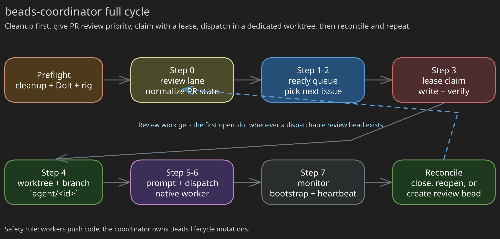
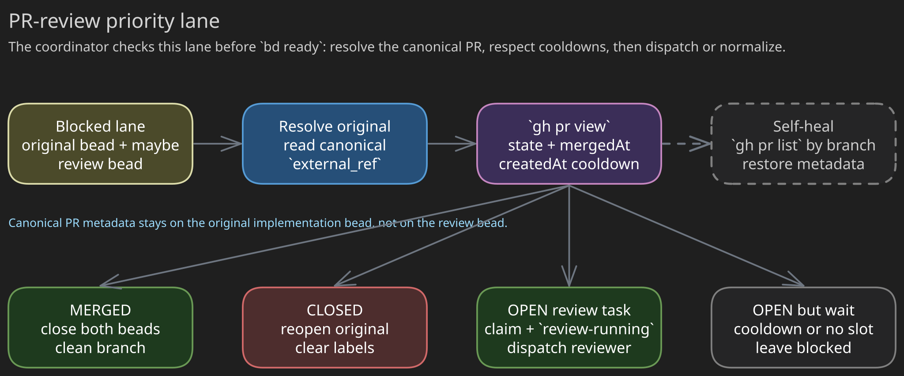

# beads-coordinator

`beads-coordinator` is the orchestration subskill for unattended Beads
throughput. It does not implement code. It continuously normalizes Beads state,
gives PR-review work priority, claims ready issues atomically with `bd update --claim`,
dispatches isolated workers, and reconciles worker outcomes back into Beads.
Workers push code and report; the coordinator owns the Beads state machine.

## How To Start It

1. Run `../beads-cleanup/SKILL.md` to reconcile stale state. Mandatory.
2. Load [`SKILL.md`](SKILL.md) (the router) and follow its dispatch quickstart.
3. Drive the loop from [`references/coordinator-loop.md`](references/coordinator-loop.md).

## Diagrams

Source: [`assets/coordinator-cycle.excalidraw`](assets/coordinator-cycle.excalidraw)

Source: [`assets/pr-review-lane.excalidraw`](assets/pr-review-lane.excalidraw)

## Where Things Live

The router states the non-negotiable invariants once; each procedure has a
single owning reference. See the read-order table in [`SKILL.md`](SKILL.md).

- [`SKILL.md`](SKILL.md) — router, invariants, dispatch quickstart, rig targeting.
- [`references/coordinator-loop.md`](references/coordinator-loop.md) — steps 0-8,
  PR-review lane, bootstrap, report contracts, reconciliation, progress report,
  adaptive polling.
- [`references/runtime-and-safety.md`](references/runtime-and-safety.md) —
  model selection, atomic claim + stall-heartbeat model, mutation safety, closure rule,
  runtime dispatch notes.
- [`references/epic-coordination.md`](references/epic-coordination.md) — epic
  classification, Team Lead mode + prompt, blocker handling.
- [`references/commands.md`](references/commands.md) — `bd` quick reference,
  claim/heartbeat checklist, session-completion checklist.
