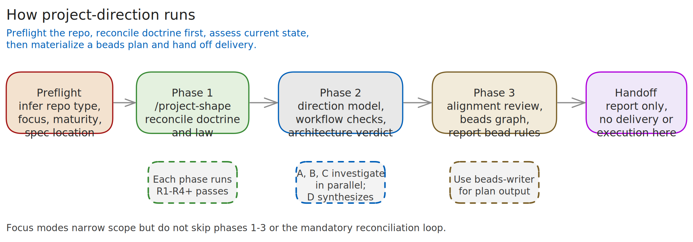
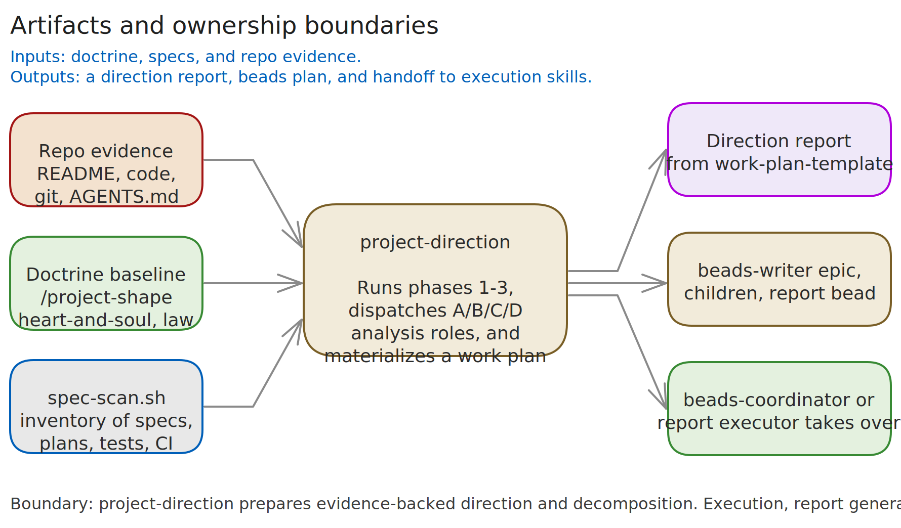

# Project Direction Skill

`project-direction` is the planning and prioritization skill for deciding what a software project should do next. It does not implement features. It reconciles doctrine, specs, repository evidence, and implementation reality, then produces a spec-backed direction report plus an execution-ready beads graph.

This skill is for questions like:

- What should this project work on next?
- Should we build feature X?
- Does the code still match the spec?
- Which roadmap items are aligned, premature, or misaligned?
- How should this be broken into beads?

## Core contract

- Specifications are the source of truth. If a capability is not covered by a spec, recommend spec work first.
- No coding before signoff. Spec writing or updates come before implementation unless the task is a pure refactor or a bug fix already defined by spec.
- Evidence beats assumption. Claims should be labeled `[Observed]`, `[Inferred]`, or `[Unknown]`.
- Push back directly on overreach, wishful thinking, feature creep, and architecture avoidance.
- Optimize for low-churn execution. Prefer coherent sequencing over aggressive parallelism.
- Delivery ownership stops at the work plan and bead graph. Execution belongs to `beads-coordinator`.

## Workflow Overview



The workflow is intentionally serialized at the phase level:

1. Preflight: infer project type, users, maturity, spec location, and analysis focus.
2. Phase 1: run `/project-shape` reconciliation so doctrine, law, and spec intent are coherent before planning.
3. Phase 2: assess project spirit, spec adherence, workflows, architecture, tests, observability, and delivery readiness.
4. Phase 3: evaluate tractability and alignment, then materialize a sequenced beads graph.
5. Reconciliation: every phase must survive at least four dedicated review passes (`R1`-`R4+`).
6. Handoff: emit the direction report and explicit beads handoff to `beads-coordinator`.

## Preflight

Before the main phases, gather or infer:

| Parameter | Typical values |
|---|---|
| Project type | library, SDK, backend, SaaS, frontend, CLI, mobile, monorepo, ML/data, internal tool, IaC |
| Primary user | developers, end users, internal team, enterprises |
| Maturity | prototype, beta, production, mission-critical |
| Spec location | `openspec/`, `spec/`, `docs/design/`, or none |
| Focus | full direction analysis, feature evaluation, spec-drift check, work decomposition |

The skill should also identify obvious evidence sources up front: README, specs, architecture/design docs, issue tracker state, test structure, and recent git activity.

## Phase 1: Doctrine First

Phase 1 is a `/project-shape` reconciliation pass. The goal is to establish whether the requested or proposed work fits the project's actual doctrine before any deeper planning happens.

Expected work in this phase:

- Reconcile `about/heart-and-soul/` and `about/legends-and-lore/` into one doctrine-and-policy baseline.
- Map proposed work back to explicit goals, non-goals, and operational constraints.
- Surface doctrine/spec contradictions without inventing a resolution.
- Refuse planning that conflicts with the project's declared identity.

If doctrine is missing or incoherent, say so directly. The right output may be direction-setting or spec work rather than feature planning.

## Phase 2: Direction Model And Evidence Passes



Phase 2 builds the direction model from repository evidence. The mandatory starting point is:

```bash
bash scripts/spec-scan.sh <repo_root>
```

`spec-scan.sh` inventories:

- Spec and design documents
- Roadmap and planning artifacts
- Agent-context files such as `AGENTS.md`
- Issue-tracking signals including `.beads/`
- Top-level docs, package manifests, tests, CI, and git activity

After the scan, the skill dispatches the analysis roles defined in `references/subagent-template.md`:

- Agent A: project spirit and requirements
- Agent B: spec adherence and workflow completeness
- Agent C: implementation fitness, tests, observability, delivery readiness, architectural fitness
- Agent D: alignment review and gap analysis, after A/B/C have produced evidence

Phase 2 is grounded by `references/direction-model.md` and `references/alignment-review.md`. The deliverable should cover:

- Project spirit summary
- Requirements classified as hard, soft, non-goal, or unknown
- Explicit versus implicit goals
- Reality check on tractability and overreach
- Current-state assessment across spec adherence, workflows, tests, observability, delivery readiness, and architecture
- Key contradictions between docs/specs and implementation
- Alignment matrix and gap analysis for proposed work

## Phase 3: Align, Sequence, Materialize

Phase 3 turns the analysis into work the project can actually execute. This phase uses `references/work-plan-template.md` plus the beads conventions enforced elsewhere in the repo.

Rules for the resulting plan:

- Every work item links to a specific spec section, or begins with explicit spec work.
- Chunks target roughly 3-10 hours and have verifiable acceptance criteria.
- Parallelism is conservative; serialize when shared modules or architecture boundaries would create churn.
- Each chunk gets a reconciliation step.
- Multi-chunk blocks also get a block-level reconciliation step.

When the plan is large enough to justify epics, `project-direction` should hand off to `/beads-writer` to create the actual graph. Non-trivial epics must include a report bead as described in `references/epic-report.md`.

## Mandatory Reconciliation Passes

The reconciliation loop is not optional. For each phase, run at least four passes (`R1`-`R4`) and continue if acceptance criteria are still not met.

Each pass should:

1. Use a dedicated subagent.
2. Review the latest generated artifacts and any relevant diffs.
3. Check for contradictions, omissions, drift, weak assumptions, and unverifiable claims.
4. Map findings to concrete evidence and to the phase acceptance criteria.
5. Apply fixes before launching the next pass.

The default persona for those passes is a skeptical architect performing an unbiased reconciliation review. The skill should treat reconciliation as a quality gate, not a polish step.

## Focus Modes

The phase structure stays intact across all focus modes. What changes is the width of the analysis, not the existence of the phases.

- Full direction analysis: run the whole workflow and produce the full handoff report.
- Feature evaluation: narrow all phases to the candidate feature, but still do doctrine and tractability checks.
- Spec-drift check: emphasize spec adherence and divergence, then generate corrective beads for confirmed gaps.
- Work decomposition: keep breadth minimal and optimize Phase 3 output for an execution-ready breakdown.

## Edge Cases

- No specs exist: create or recommend initial spec work first; do not skip doctrine reconciliation.
- Specs exist but are stale: produce a corrective spec changeset before implementation work.
- No clear project direction: say so directly and recommend a direction-setting or spec sprint.
- Conflicting specs: flag contradictions with evidence from both sides and escalate to the user.
- Very large spec surfaces: fully audit core capabilities and sample secondary areas instead of pretending to exhaustively review everything.

## Output Contract

The final artifact is a direction report shaped by `references/work-plan-template.md`. It should answer:

- What is the project's real direction?
- What should it work on next?
- What should it stop pretending it can do?
- Which work graph was generated, and why is it coherent with doctrine, law, and spec?

This skill does not execute the beads. It hands off explicitly to `beads-coordinator`.

## Scripts And Reference Files

Primary references:

- `references/direction-model.md`
- `references/alignment-review.md`
- `references/work-plan-template.md`
- `references/subagent-template.md`
- `references/epic-report.md`

Helper scripts:

- `scripts/spec-scan.sh <repo_root>`: discover specs, docs, AI context, issue tracking, tests, CI, and git signals.
- `scripts/epic-report-scaffold.sh <epic-id> [repo_root]`: scaffold the markdown report for a report bead executor.

## Report Bead And `/excalidraw-diagram` Integration

When Phase 3 creates a non-trivial epic, the report bead is the bridge from planning into human-readable review output.

The intended flow is:

1. `/beads-writer` creates the epic, its implementation children, and a final report bead.
2. The report bead executor runs:

```bash
bash scripts/epic-report-scaffold.sh <epic-id> [repo_root]
```

3. The scaffold creates `docs/reports/<epic-id>-<slug>.md` and the related diagrams directory.
4. The executor then uses `/excalidraw-diagram` to create rendered architecture or workflow diagrams and embeds them into the report.
5. Remaining TODOs discovered during report writing become new follow-up beads.

That is why this README includes SVGs generated from local `.excalidraw` sources in `references/diagrams/`: the skill is expected to produce rendered visual artifacts as part of the reporting path, not just prose.

## Diagram Sources In This README

The embedded SVGs in this README were rendered locally from:

- `references/diagrams/project-direction-workflow.excalidraw`
- `references/diagrams/project-direction-artifacts.excalidraw`

Using:

```bash
python3 ../excalidraw-diagram/scripts/render_excalidraw.py references/diagrams/project-direction-workflow.excalidraw --format svg
python3 ../excalidraw-diagram/scripts/render_excalidraw.py references/diagrams/project-direction-artifacts.excalidraw --format svg
```
