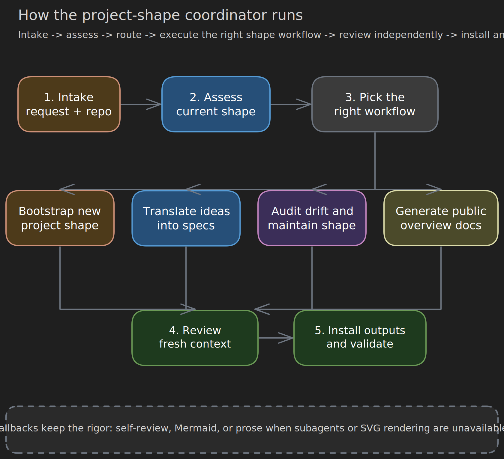
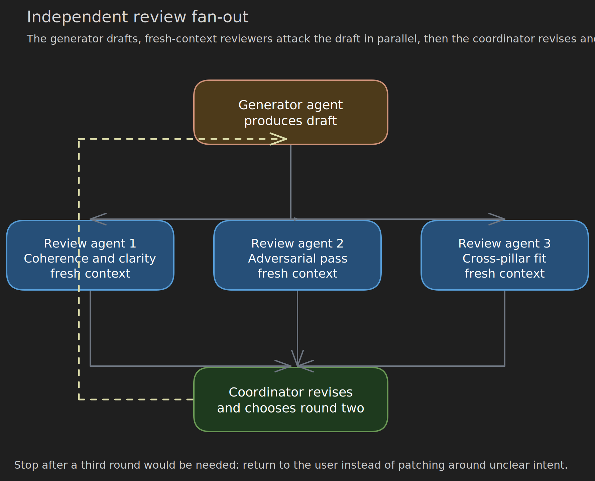

# Project Shape Coordinator Workflow

This README explains the end-to-end orchestration performed by the primary agent running `$project-shape`.

There is no separate `project-shape` coordinator binary or dedicated coordinator agent in this package. In this document, **coordinator** means the lead agent that owns intake, routing, synthesis, review, and installation across the five-pillar shape workflow.

## End-To-End Flow



The coordinator operates in six stages:

1. **Intake**: read the user's request, inspect the repository, and decide whether the job is shape assessment, bootstrap, idea translation, maintenance, or overview generation.
2. **Assess**: run `scripts/shape-scan.sh` when possible, then inspect pillar coverage manually if needed.
3. **Route**: choose the correct workflow based on repo state and user intent.
4. **Execute**: run the selected workflow with the correct pillar order and related skills.
5. **Review**: use fresh-context review agents when available; otherwise run explicit coherence and adversarial self-review.
6. **Install**: write or update docs, local skills, and overview assets, then validate with the package scripts.

## Routing Logic

| Situation | Coordinator route | Primary outputs |
| --- | --- | --- |
| New project or missing doctrine | Bootstrap shape | `about/`, `openspec/`, local pillar skills |
| New product idea or change request | Translate idea into requirements | doctrine checks, RFC updates, `openspec/` deltas, task-ready requirements plus execution-quality expectations |
| Existing docs drift from implementation | Audit and maintain shape health | revised pillar docs, drift findings, review summaries |
| Project needs a public-facing explanation | Generate overview | `about/README.md` plus rendered diagrams |

The coordinator should not collapse these paths into one generic doc-writing loop. Each route has a different quality bar, different review scope, and different outputs.

## Five-Pillar Backbone

Every route runs on the same backbone:

- `about/heart-and-soul/` answers **why** the project exists and what it refuses to become.
- `about/law-and-lore/` records **how** key technical decisions work and why those trade-offs were accepted.
- `openspec/` states **what** must be built in testable, normative language.
- `about/lay-and-land/` explains **where** components, boundaries, and deployments live.
- `about/craft-and-care/` defines **how work is executed well**: the engineering standards for implementation, verification, review, operability, and maintenance.

The coordinator works top-down through the semantic spine. Doctrine grounds RFCs, RFCs ground specs, and specs ground execution planning. `lay-and-land` is the spatial cross-cut: update it anywhere the placement of components, boundaries, or data flow matters. `craft-and-care` is the execution-quality cross-cut: it defines how changes touching any pillar must be implemented, verified, reviewed, documented, and operated.

## Workflow 1: Bootstrap Shape

Use this when the project has weak or absent shape. The coordinator should:

1. Run the consultative interview from [`references/consultative-bootstrapping.md`](references/consultative-bootstrapping.md).
2. Synthesize draft doctrine first, then draft a minimal `craft-and-care` baseline, then design contracts and specs, while starting topology as soon as the architecture track is clear.
3. Scaffold directories with `scripts/shape-init.sh` once the content direction is stable.
4. Install or refresh local pillar skills from [`references/local-skill-templates.md`](references/local-skill-templates.md).
5. Validate with `scripts/shape-scan.sh` and `scripts/self-test.sh`.

Read [`references/bootstrapping.md`](references/bootstrapping.md) for the phase-level checklist and common failure modes.

## Workflow 2: Translate Ideas Into Requirements

This route turns a fuzzy idea into work that can be implemented without losing the doctrine:

1. Kill or reshape the idea if it conflicts with doctrine.
2. Place it in the topology so the coordinator knows where the change lives.
3. Write or update design contracts for the intended behavior.
4. Extract precise spec requirements and scenarios.
5. Apply the `craft-and-care` gate so the change has explicit expectations for verification, observability, review, compatibility, documentation, and operational care.
6. Hand the sharpened output to task planning or downstream execution workflows.

This is the route that prevents "good sounding" ideas from skipping directly to code.

## Workflow 3: Audit And Maintain Shape Health

Use this when the project already has shape but coherence has drifted.

The coordinator audits:

- **Coverage**: which RFCs, specs, and topology docs are missing traceability.
- **Freshness**: which docs no longer reflect the code or operating model.
- **Gaps**: code with no spec, specs with no doctrine, or design docs that never became requirements.
- **Orphans**: principles, RFC sections, or maps that no longer drive anything real.
- **Execution drift**: changes that technically work but no longer meet the project's documented standards for testing, observability, review, documentation, dependency hygiene, or maintenance.

When drift is found, update only the affected sections first, then run delta review instead of re-reviewing the entire corpus.

Use [`references/maturity-rubric.md`](references/maturity-rubric.md) to interpret scan output and [`references/evaluation-scenarios.md`](references/evaluation-scenarios.md) to pressure-test fallback behavior.

## Workflow 4: Generate A Project Overview

Use this route when at least two pillars exist and the project needs a human-friendly `about/README.md`.

The coordinator should:

1. Extract only the layman-relevant narrative from each pillar, mentioning `craft-and-care` lightly as the project's execution-quality standards rather than dumping internal process detail.
2. Design 3-5 diagrams with `/excalidraw-diagram`, preferring SVG output.
3. Write the overview in thesis-first order: what it is, what it is not, how it works, what v1 delivers, and how to navigate the docs.
4. Store overview assets in `about/assets/`.
5. Review for accessibility and adversarial clarity before treating the overview as done.

See [`references/generate-overview.md`](references/generate-overview.md) for the document skeleton and diagram guidance.

## Review Contract



Generated shape artifacts are not considered settled until review completes.

- **Primary mode**: one generation agent plus independent review agents for coherence, adversarial pressure, and cross-pillar alignment.
- **Cross-pillar review duty**: check execution fit as well as semantic fit. If doctrine, RFCs, specs, or topology imply testing, observability, documentation, compatibility, or operational obligations, `craft-and-care` should make those standards explicit.
- **Revision rule**: revise after findings, then run a second round only if the first review surfaced major issues.
- **Stop rule**: if a third round would be needed, the coordinator should return to the user and reopen the interview rather than papering over unclear intent.
- **Fallback mode**: when subagents are unavailable, run two explicit self-review passes and surface unresolved risk plainly.

Read [`references/review-protocol.md`](references/review-protocol.md) for the review prompts and iteration limits.

## Operational Checklist

The coordinator's normal command path inside this skill is:

```bash
bash scripts/shape-scan.sh [project-root]
bash scripts/shape-init.sh [project-root]
bash scripts/self-test.sh
bash scripts/eval-fallbacks.sh
```

Use `/excalidraw-diagram` when diagrams materially improve comprehension. If the renderer is unavailable, degrade to Mermaid or prose without weakening the review discipline or the five-pillar ordering.

## Related Skills

- `/excalidraw-diagram`: render conceptual and technical SVG diagrams used by shape docs and overviews.
- `/project-direction`: turn reconciled shape into priority-weighted work planning.
- `/reconcile-spec-to-project`: compare `openspec/` against actual implementation.

The coordinator owns the routing decision; these related skills execute focused subtasks once the route is clear.
